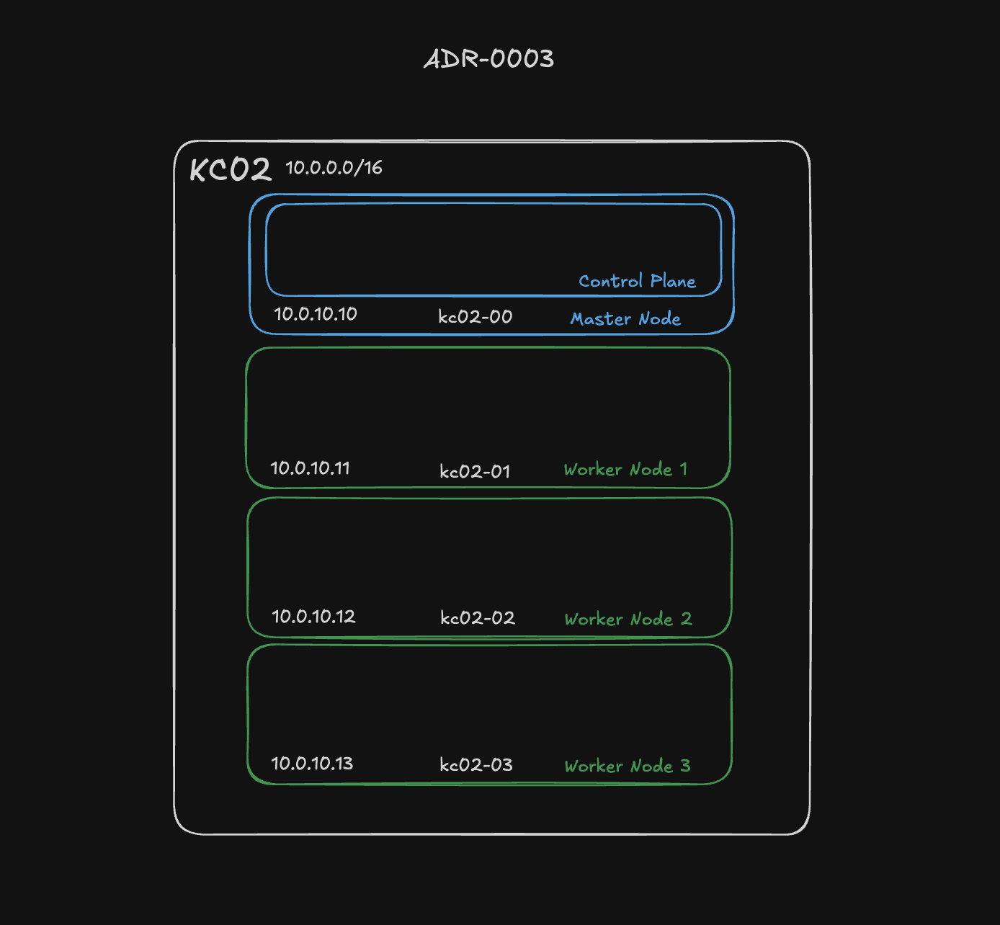

# ADR-0003: Select Mini PCs and Debian 13 for Node Hardware

**Status:** Accepted  
**Date:** 2025-04-27

## Context

Hardware selection needed to balance cost, reliability, and energy efficiency for the homelab Kubernetes deployment. Additionally, an operating system with a stable and predictable release cycle was important to minimize maintenance overhead.

## Decision

Use inexpensive, used mini PCs as cluster nodes, running Debian 13 as the operating system. The cluster will be configured with 1 Master Node and 3 Worker Nodes to provide resilience against failure of any single node.

## Rationale

- **Cost Efficiency**: Used mini PCs offer substantial savings compared to new hardware.
- **Form Factor**: Mini PCs have small footprints, ideal for homelab setups with limited space.
- **Power Consumption**: Mini PCs are more energy-efficient than traditional server hardware, reducing operating costs.
- **Failure Tolerance**: `Kubernetes` provides resilience against individual node failures, making the risk of using used hardware more acceptable.
- **Operating System Stability**: `Debian 13` was selected for its long and stable release cycles, critical for minimizing disruptive upgrades.
- **Timing**: `Debian 13` entered soft freeze as of April 15, 2025, and is expected to be fully released before the completion of the KC01 cluster project.

## Master Node Hardware Details

| Component       | Specification                         | Notes                        |
|-----------------|---------------------------------------|------------------------------|
| **Model**       | Dell Optiplex 3060 Mini Desktop PC    |                              |
| **CPU**         | Intel Core i5-8500T                   | 6-core, 6-thread             |   
| **RAM**         | 24GB DDR4                             | From existing homelab        |
| **Storage**     | 512GB NVMe SSD                        | Expandable with SATA slot    |
| **Networking**  | 1 Gbps Ethernet                       |                              |
| **Cost**        | Existing hardware                     |                              |

## Worker Node Hardware Details

| Component       | Specification                         | Notes                        |
|-----------------|---------------------------------------|------------------------------|
| **Model**       | HP ProDesk 600 G4 Mini Desktop PCs    |                              |
| **CPU**         | Intel Core i5-8500T                   | 6-core, 6-thread             |   
| **RAM**         | 8GB DDR4                              | Upgradeable to 64GB          |
| **Storage**     | 128GB NVMe SSD                        | Expandable with 2nd M.2 slot |
| **Networking**  | 1 Gbps Ethernet                       |                              |
| **Cost**        | Under $300 total                      | Used via eBay                |

## Potential Upgrade Paths

- **RAM**: Increase to 16GB per worker node.  
  - OS + Kubernetes services take ~2GB, leaving 14GB for workloads.  
  - 8GB DDR4 SODIMM costs ~$17 each on Amazon.
- **Storage**: Add an additional NVMe drive per node for persistent storage solutions like Longhorn.

**Alternatives Considered:**
1. **New Hardware**: More reliable but cost-prohibitive for the intended scale.
2. **Other Distributions**: Faster-moving distributions (e.g., Ubuntu, Fedora) were considered, but Debian's conservative approach better matched homelab stability goals.
3. **3 Control Plane Configuration**: A 3 control plane, 4 worker node setup was considered but deemed overly complex for a homelab scenario and not commonly applicable in production scenarios (AWS EKS and Azure AKS provide managed control planes).

## Consequences
- **Positive**:  
  - Lower upfront costs.  
  - Acceptable reliability with Kubernetes redundancy.  
  - Efficient power usage.  

- **Trade-off**:  
  - Potential for higher node failure rates over time.  

- **Control Plane Failure**:  
  - A single failure of the Master node results in loss of pod scheduling.  
  - Existing services and workflows remain unaffected.
