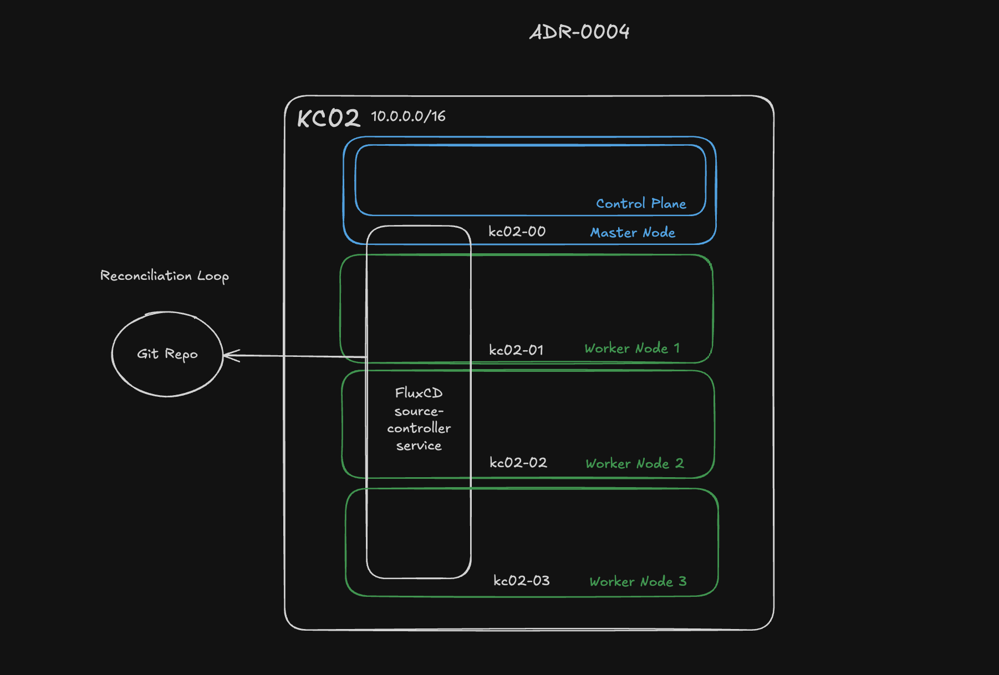

# ADR-0004: Use FluxCD for GitOps Deployment

**Status:** Accepted  
**Date:** 2025-04-27

## Context

The homelab cluster aims to mirror best practices seen in modern cloud-native infrastructure while remaining lightweight and manageable. Thus, a GitOps-based workflow was desired to manage the Kubernetes cluster deployments, ensuring all cluster state is defined declaratively in Git and changes are auditable and reversible.

The two primary contenders evaluated were FluxCD and ArgoCD — both popular, mature GitOps solutions for Kubernetes.

## Decision

Adopt FluxCD for managing Kubernetes deployments via GitOPs. FluxCD runs as a set of controllers inside the control plane and periodically polls a git repository for changes. When changes are detected, it reconciles the changes and applies the desired state to the cluster. This is called the reconciliation loop.

The repository structure will be of Monorepo as described in [FluxCD: Repository Structure](https://fluxcd.io/flux/guides/repository-structure/).

## Rationale

- **Native Kubernetes Integration**: FluxCD runs as native Kubernetes controllers without requiring a dedicated web UI or external server, minimizing complexity.
- **Declarative Everything**: Git is the single source of truth, enabling easy recovery, rollbacks, and change tracking.
- **Strong Community**: FluxCD is a CNCF incubating project with a healthy community and frequent updates.

**Alternatives Considered:**
- **ArgoCD**: Offers a richer UI and more advanced deployment strategies (e.g., blue-green, canary). Rejected for now due additonal complexity and desire to rely on CLI and automation instead of leaning on a UI.
- **Manual kubectl Apply**: Initially simpler but scales poorly and lacks the auditability, consistency, and automation that GitOps provides.

## Consequences

- **Positive**: 
  - Declarative cluster management with Git as the single source of truth.
  - Minimal ongoing manual intervention needed once automation is set up.
  - Easier disaster recovery by reapplying Git state. Can also change kubernetes deployment from k3s to Talos easily in the future.

- **Trade-off**: 
  - FluxCD does not have as rich a UI as ArgoCD, requiring familiarity with kubectl, YAML, and Git.
  - Debugging deployment issues may require more manual investigation compared to UI-driven tools.

- **Future Considerations**: 
  - As the cluster grows, revisit whether a hybrid approach (e.g., using ArgoCD for certain applications) could be beneficial.
