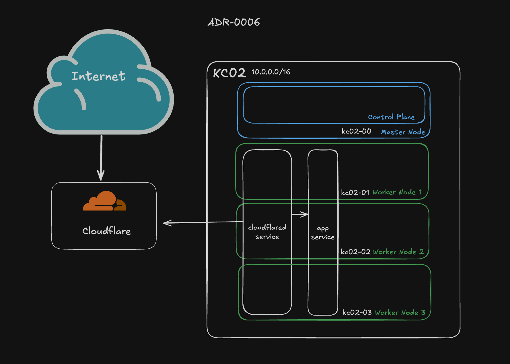

# ADR-0006: Use Cloudflare Tunnel to Safely Expose Services to the Internet

**Status:** Accepted  
**Date:** 2025-04-30

## Context

Self-hosting applications in a homelab often requires external access to certain services (e.g., media servers, dashboards, etc.). Traditional methods for achieving this involve port forwarding on a router and exposing the home’s public IP address, which introduces security risks, or may require dynamic DNS solutions.

## Decision

Use Cloudflare Tunnel to securely expose internal services to the internet without requiring port forwarding or public IP exposure.

Note lack of inbound connections into the home network. The cloudflared daemon makes an outbound connection to Cloudflare.

## Rationale

- **Security**: No open inbound ports; tunnel initiates outbound connections to Cloudflare, minimizing the attack surface.
- **Simplicity**: Eliminates the need for router configuration and dynamic DNS setup.
- **Zero Trust Compatible**: Easily integrates with Cloudflare Access for authentication and fine-grained access controls.
- **Free Tier**: Cloudflare Tunnel (formerly Argo Tunnel) provides up to 100 tunnels at no cost.

**Alternatives Considered:**
- **Port Forwarding + Dynamic DNS**: While simple, this exposes the home IP and increases risk. Requires careful firewall and authentication hardening.
- **Reverse Proxy with Public IP**: Requires hardnening of service as it requires open ports.
- **VPN-Only Access**: Adds friction for casual or mobile access. Not user-friendly for shared family use cases.

## Consequences

- **Positive**:
  - Improved security by eliminating public IP exposure.
  - Simplified networking and deployment.

- **Trade-off**:
  - Dependency on Cloudflare’s infrastructure, availability, and generous free tier.

- **Future Considerations**:
  - Evaluate self-hosted alternatives if full control is needed.
